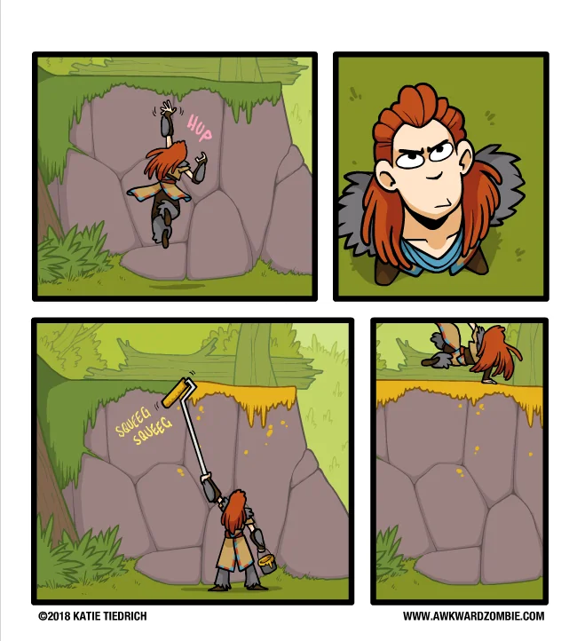
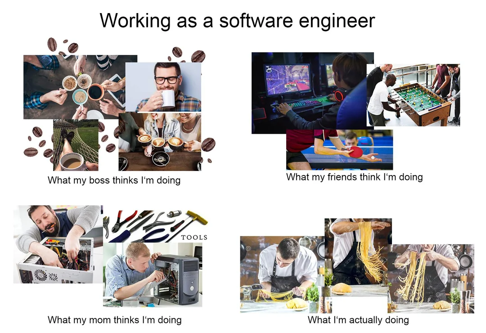

<h1> Intro: The Illusion of Life </h1>
      

            
      

       
      
 
        <em> AI have alwayes been a subject that always intreegd me but never really hade the time to explore fully and this fact made it a perfect opertunity to dive into it.</em>
      

      
 Term A.I. have two definistions: 

        <ul>
          <li> <em> Artificial Intelligence: </em> The most common term for what people think of when we say A.I. </li>
          <li> <em> Algorithmic Intelligence: </em> The best term for what we see in video games. </em> </li>
        </ul>
      

            Artificial Intelligence is overkill for majoraty of video games since we only need to minic intelligence to make it feel alive. There is also one more thing that A.I.                       needs to make it perfect. It need to be <strong>"Fair Challenge"</strong> to the players and play by the same rules that the player do. It may sound wrong untill you                        think deeper about it.
      

      
 There is a reason why cheats are hated amongst games is a gives a unfair advantage that is inhuman. A few exampels of first person shooter games are: 

      <ul>
            <li> <strong><em> Aimbot: </em></strong> Instantly React and Aim with perfect accuracy. </li>
            <li> <strong><em> Wallhacks: </em></strong> Ability to see through walls and objects and they see you long before you can see them. </li>
      </ul>
      
 The reason for why I'm talking about cheats when talking about A.I. is that without carefull thinking and counter messures, A.I. can easly feel like they are cheating. 

      
 A.I. that aims and shoot perfectly feels artificial. Shoot you immediately when you turn a courner or shoot you through wall break game immersion.  

      
 The Illusion of a fair game is important to maintain. As long as they think it's a fair challenge, players will blame there own skill when they fail. The moment that illusion is broken, they will blame the game.

       
      
<h1> My goal with this project </h1>
      
 My goal with my thesis is to use several A.I. patters that see use in video games and try to explain it's advantadges and disadvantages with each pattern. 

      <blockquote> 
 Hint: It's mostly a question about Time vs. Scalability. 
 </blockquote>
      
 The Patterns I'm goint to talk about are: 

      <ul>
            <li> <strong><em> Unstructured: </em></strong> A simple solution for simple behaviour. </li>
            <li> <strong><em> State Machine: </em></strong> Crawling, Walking and Running. All are ways to move around, but you can only do one at the time. </li>
            <li> <strong><em> Behaviure Tree: </em></strong> Form root to leaf, you must follow the branches to get to you goal. </li>
            <li> <strong><em> G.O.A.P: </em></strong> A pattern with manny surprises and unexpected results. </li>
      </ul>
      
 I will also give example of games that imploments these patterns.

     
     

<h1> Unstructured Pattern </h1>
      

            
      

      
 "Unstructured Pattern" sounds counter intuitive and you are not wrong. The thing is there are many exampels of game enemys that are stupidly simple and i what to high light this. There are game that have enemys that literally only move towards the player and have become successful games. 

<h2> <strong><em> Vampire Survivors </em></strong> </h2>
            

<h1> State Machine Pattern </h1>
      

            
      

      
https://medium.com/@umut_cirak/state-machines-choosing-the-right-ai-model-for-your-game-298fdfe8b7c6

<h1> Behaviour Tree Pattern </h1>
      

            
      

      
 https://www.gamedeveloper.com/programming/behavior-trees-for-ai-how-they-work 

