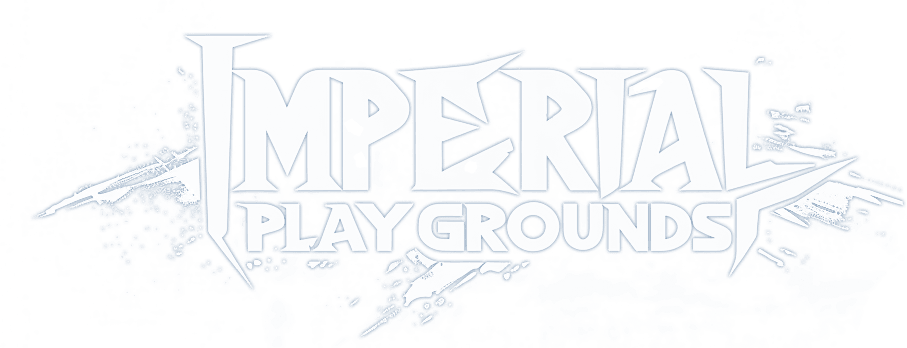

# Imperial Playgrounds </h1>

    

### <a href="https://github.com/Erik2333/Resume_ErikBerglund/blob/main/README.md"> Back to Main Page </a> <h3>

## Header

 
    Text.

 
 

## My Responsibilities
 

## Pull Lever

 

## Mushroom

 

## Pull Rock

 

## Ground Pound Sensor

 

## Gampad UI Support

 

## Settings Menu(and Save class)

 

## Trophy Room Renovation

 

