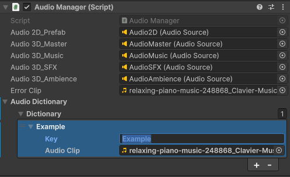
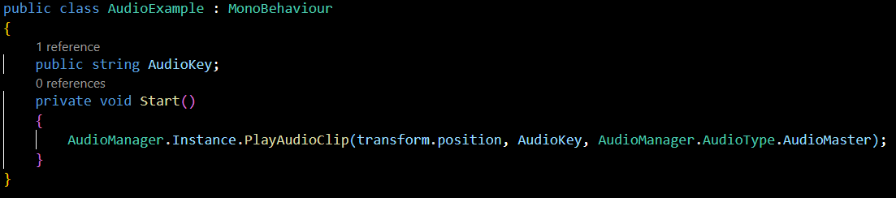
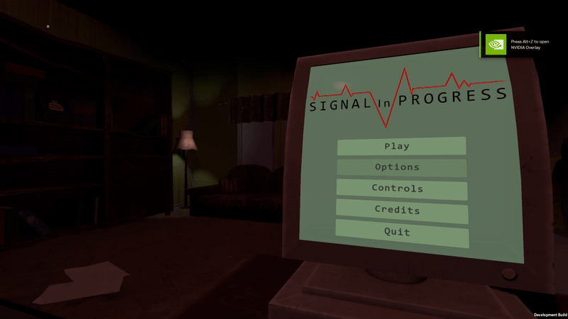

<h1> Project Solar </h1>
    
    <h3> <a href="https://github.com/Erik2333/Resume_ErikBerglund/blob/main/README.md"> Back to Main Page </a> <h3> 
    <!-- <a href=https://yrgo-game-creator.itch.io/signal-in-progress> 
 Itch Link 
 </a> -->
    <h2> <em> Header </em> </h2>
        
 
            Text.
        

         
    <h2> <em> My Responsibilities </em> </h2>
      <!--
        

            On the first day we divided up the work and thing we needed to be done to get a playable game.
            We decided early in the project that Audio was important for our game. Since I had some experience with it from Pogo Pirates nobody minded me being responsible for it.
        

        
 I also took on making the Main Menu and Settings since i needed to setup an audio mixer. 

        
 Also helped out with testing, finding bugs, identify the root of the problem. After that, I'll talk to the person how made the bug if he wanted me to try to fix it. 

      -->
            <!--
    <h2> <em> Audio System </em> </h2>
      
 
            I decided early to try to make it easy to use Audio Manager that was easy to use. After some prototypes, some advice and wishes from my team the result was an Audio Manager that implements:  
            <ul>
            <li> Audio dictionary where you store audio clips and give that clip a key use to fetch the clip in code </li>
            <li> Functions that easy to use and gives Audio Sources where sound need to be played. </li>
            <li> Object pooling that reuse inactive Audio Sources when needed. </li>
            </ul>
        
  
            -->
      <!--
        
        
      -->
    

        
<h3><em> DropDown. </em></h3>

    

      <!--
<h2> <em> Menu And Settings </em> </h2>
        
 
            When it comes to UI it is something i do enjoy working with and I never had made an option menu before was a intresting experiance.  
             
            I starded by researching what common functionalities menu needs and then deciding what we needed to implements.  
            Then made some UI prefabs so I could quickly update them if required, I didn't have to change one piece at the time.  
             
            When it comes to settings, I did encounter some interesting logic problems and some bugs reinforced why testing build versions of the project is so important.  
             
            Overall I did enjoy working with UI and hope to work more with it in the future.
        

      -->
