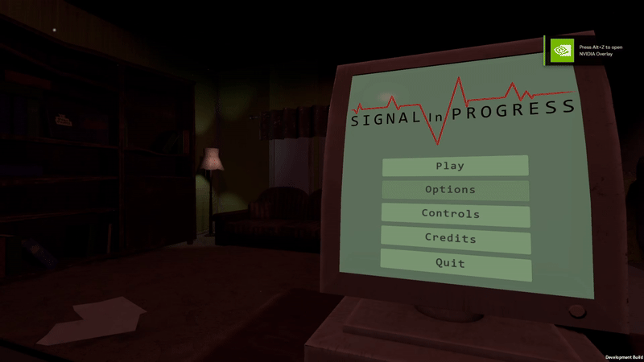

<body>
    <h1> Pogo Pirates </h1>
     <em> Game description </em> </h2>
        <p> 
            Smash style platform fighter.
        </p>
        <br>
    <h2> <em> My Responsibilities </em> </h2>
        <ul>
            <li> Level Desine and Testing </li>
            <li> Audio Implumentation </li>
            <li> Audio Tweeking </li>
        </ul>
    <h2> <em> Level Desine and Testing </em> </h2>
        <p> We feelt that good level desine was important and early gameplay had players falling of platforms to manny times in early testing. </p>
        <p> I took the time to explore the players movement and how platforms needed to be placed to ensure players can be more in control of there jumps. </p>
        </p>
    <details>
        <summary><em> Code: Audio Manager. </em></summary>
  
```csharp


```

</details>

<h2> <em> XXX </em> </h2>
        <p> 
            Text <br>
        </p>

    
  
</body>
